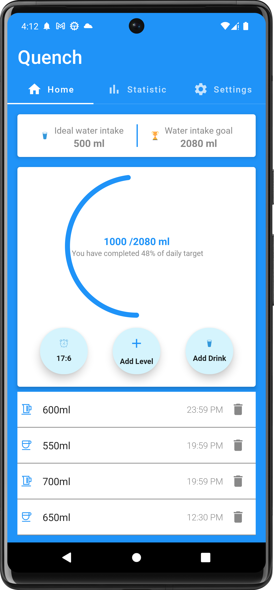
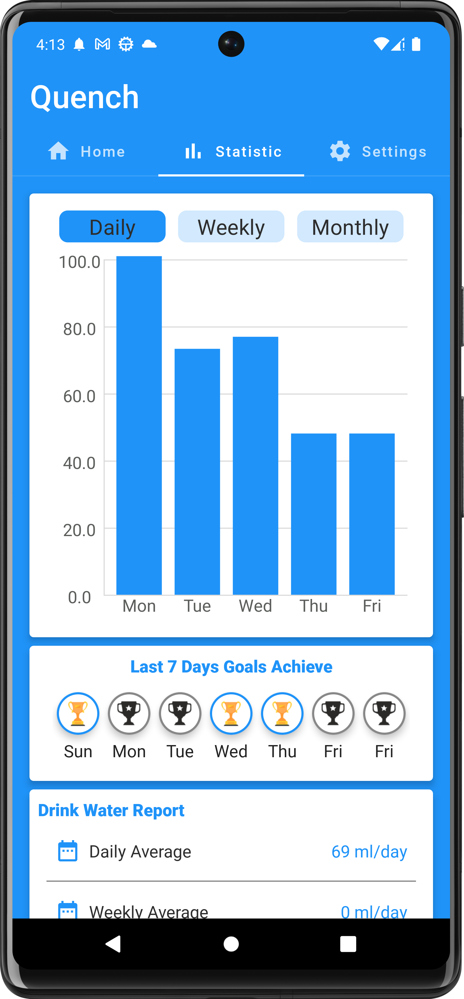
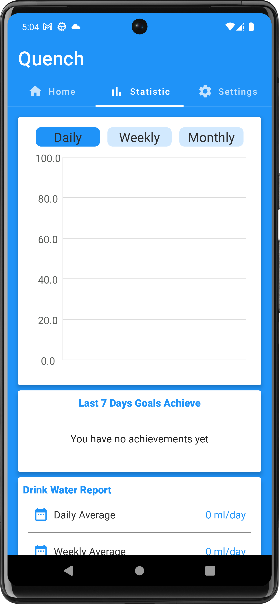
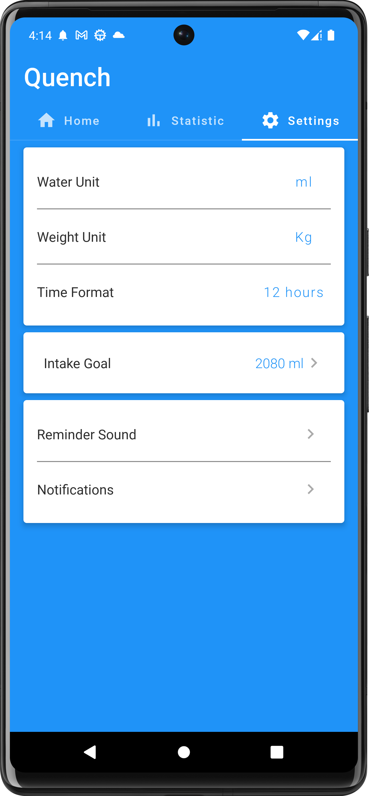
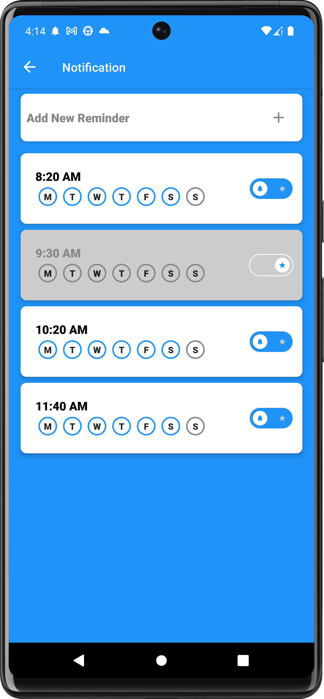
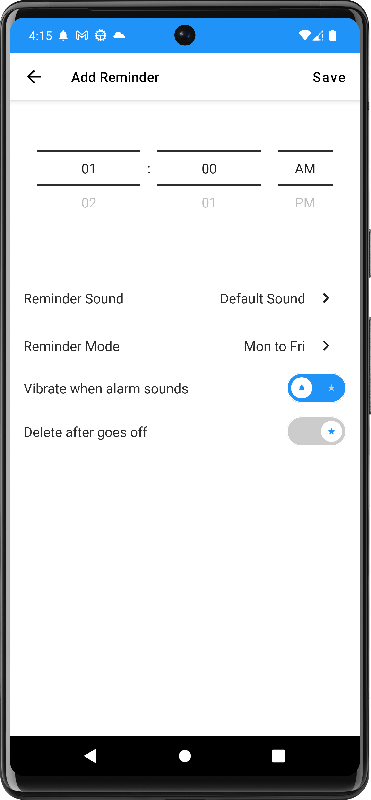

# Quench
Quench is a water reminder App  designed with one primary goal in mind, to help users stay adequately hydrated throughout their day. it is created using the cutting-edge [Jetpack compose](https://developer.android.com/jetpack/compose?gclid=Cj0KCQjwlemWBhDUARIsAFp1rLVEasIdkuT4ctD9QlZypDNFdoY-yRXDP_QQ8mE75u7P20MBBzuQiW8aAs5AEALw_wcB&gclsrc=aw.ds) and leveraging a range of modern Android libraries, this app serves as a simple yet effective tool to promote healthy hydration habits.

## Structural design pattern
The app is built with the Model-View-ViewModel (MVVM) as its structural design pattern that separates objects into three distinct groups:
  - Models hold application data. They’re usually structs or simple classes.
  - Views display visual elements and controls on the screen. They’re typically subclasses of UIView.
  - View models transform model information into values that can be displayed on a view. They’re usually classes, so they can be passed around as references.

### Home Screen
 

### Statistics Screen
 

### Settings Screen
 

### Notification Screen
 

### Add Notification Screen

## Tech Stack.
- [Kotlin](https://developer.android.com/kotlin) - Kotlin is a programming language that can run on JVM. Google has announced Kotlin as one of its officially supported programming languages in Android Studio; and the Android community is migrating at a pace from Java to Kotlin
- [Android KTX](https://developer.android.com/kotlin/ktx.html) - Provide concise, idiomatic Kotlin to Jetpack and Android platform APIs.
- [AndroidX](https://developer.android.com/jetpack/androidx) - Major improvement to the original Android [Support Library](https://developer.android.com/topic/libraries/support-library/index), which is no longer maintained.
- [Lifecycle](https://developer.android.com/topic/libraries/architecture/lifecycle) - Perform actions in response to a change in the lifecycle status of another component, such as activities and fragments.
- [Viewmodel](https://developer.android.com/topic/libraries/architecture/viewmodel) -The ViewModel class is designed to store and manage UI-related data in a lifecycle conscious way
- [LiveData](https://developer.android.com/topic/libraries/architecture/livedata) -  A lifecycle-aware data holder with the observer pattern
- [Room Database](https://developer.android.com/training/data-storage/room)- The Room persistence library provides an abstraction layer over SQLite to allow fluent database access while harnessing the full power of SQLite.
- [Kotlin Coroutines](https://developer.android.com/kotlin/coroutines) - A concurrency design pattern that you can use on Android to simplify code that executes asynchronously.
- [Hilt](https://developer.android.com/training/dependency-injection/hilt-android) -  A dependency injection library for Android that reduces the boilerplate of doing manual dependency injection in your project
- [Navigation Components](https://developer.android.com/guide/navigation/navigation-getting-started) -  Helps you implement navigation, from simple button clicks to more complex patterns, such as app bars and the navigation drawer.
- [Material Libarary](https://material.io/develop/android) -  Modular and customizable Material Design UI components for Android
- [Kotlin Flows](https://developer.android.com/kotlin/flow) - a flow is a type that can emit multiple values sequentially, as opposed to suspend functions that return only a single value.
- [RaamCosta Navigation](https://composedestinations.rafaelcosta.xyz/)- A KSP library that processes annotations and generates code that uses Official Jetpack Compose Navigation under the hood. It hides the complex, non-type-safe and boilerplate code you would have to write otherwise.
- [Alarm Manager](https://developer.android.com/reference/android/app/AlarmManager) - These allow you to schedule your application to be running at some point in the future. 
- [Work Manager](https://developer.android.com/topic/libraries/architecture/workmanager) - WorkManager is the primary recommended API for background processing.
- [Timber](https://github.com/JakeWharton/timber) - A logger with a small, extensible API that provides utility on top of Android's normal Log class.
- [Notifications](https://developer.android.com/develop/ui/views/notifications)- A notification is a message that Android displays outside your app's UI to provide the user with reminders, communication from other people, or other timely information from your app.
- [GitHub Actions](https://github.com/features/actions)-GitHub Actions makes it easy to automate all your software workflows, now with world-class CI/CD. Build, test, and deploy your code right from GitHub. Make code reviews, branch management, and issue triaging work the way you want.

## Setup Requirements
- Android device or emulator
- Android Studio

## Getting Started
In order to get the app running yourself, you need to:

1.  Clone this project
2.  Import the project into Android Studio
3.  Connect your Android device with USB or just start your emulator
4.  After the project has finished setting up it stuffs, click the run button

## Support
- Found this project useful ❤️? Support by clicking the ⭐️ button on the upper right of this page. ✌️
- Notice anything else missing? File an issue
- Feel free to contribute in any way to the project from typos in docs to code review are all welcome.

